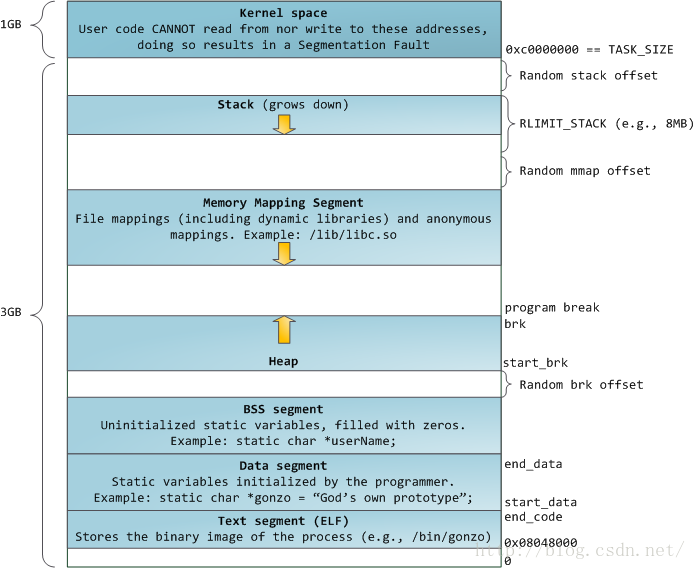

计算机不知道哪些是指令，哪些是数据，除非可执行文件告诉它从哪里开始执行。

## linux 程序的内存布局

当程序被加载时(32bit 为例)，

- 每个`.section`都被加载到字节的内存区:
  - `.text`被加载到**地址 0x08048000**
  - `.data`在`.text`之前位置被加载
  - `.bss`在`.data`之前位置被加载
- 程序栈帧从**0xBFFFFFFF**位置开始往下增长, 用于存储程序名,环境变量,命令行参数等
- 程序数据段从底部往上增长, 即 heap

每个程序都在自己的沙盒内运行, 每个程序都认为字节被加载到内存地址 0x08048000, 其栈起始位置为 0xBFFFFFFF. **程序认为字节在使用的地址称为虚拟地址, 其在芯片上的实际对应的地址称为物理地址. 物理地址分配到虚拟地址的过程叫映射**.

## Linux 内存访问方式

- 程序尝试从虚拟地址加载内存
- CPU 使用 Linux 提供的**内存查找表**, 将虚拟地址转换为物理内存地址
- CPU 发现所列的物理地址不是内存地址, 它向 Linux 请求以加载该地址
- Linux 查找该地址, 如果该地址映射到一个磁盘位置,旧继续下面步骤, **否则终止程序, 报告段错误**
- 如果没有足够的空间从磁盘装入内存, Linux 会将程序的其他都不分或另一个程序移到磁盘, 以腾出空间
- Linux 将数据移动到空闲的物理内存上
- Linux 更新**内存映射表**, 以更新上面地址的更改
- Linux 恢复程序的控制权, 让程序重新执行加载虚拟地址的指令
- 之后 CPU 旧可以使用新装入内存的虚拟地址和映射表处理该指令了

## 内存管理器

内存管理器时一组程序, **负责分配和回收内存**. 即**动态内存分配**:

- 当需要一定量的内存, 只需要告诉分配器需要多少内存, 他就会返回一个内存地址
  - `brk`系统调用(45)请求 Linux 向上移动中断点, 这样就会从未映射内存区获取一段内存映射到物理地址供程序使用
- 使用完之后, 告诉回收器要是否的内存地址, 分配器就可以重复使用该内存, 不会归还给系统
